"@/components/ui/carousel" error in remix
-------->right :"~/components/ui/carousel" use tilde sign
--------------------

// in tsx u have to put a prop className to use  the classNames in the custome component  
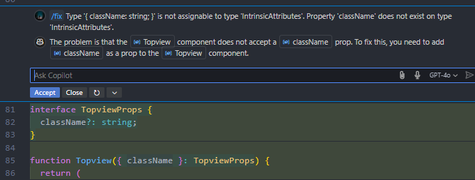
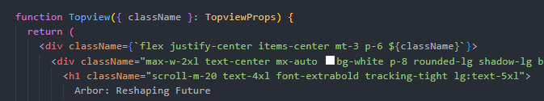
3rd: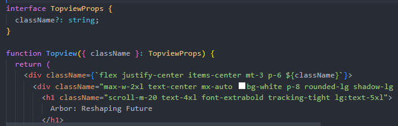
//
ex2:best example
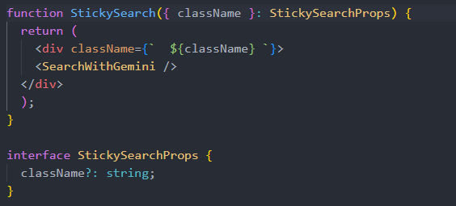
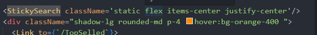
--
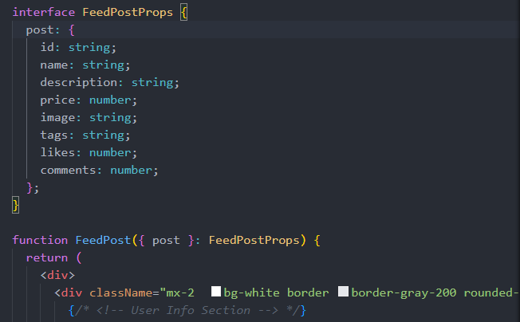
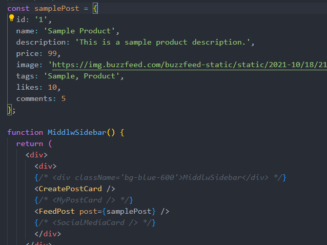
--------
css for post :
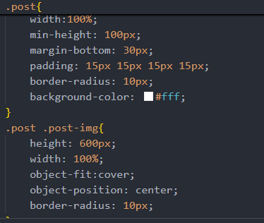

---
convert string into arrayy  use split:

-----
//### how to retreive data from single document in firestore
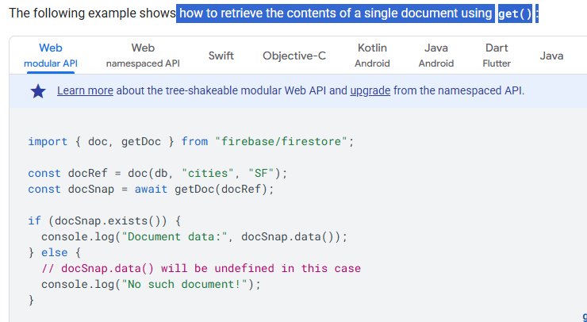

----------
//whenever you want to make complex data you need to make interface structure 
for e.g:
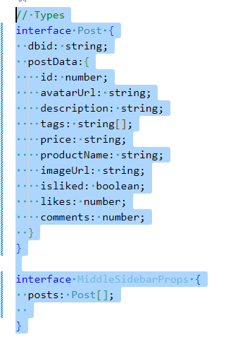
//----------

using nested object as props result errror:
// Types
interface Post {
  dbid: string;
  postData:{
    id: number;
    avatarUrl: string;
    description: string;
    tags: string[];
    price: string;
    productName: string;
    imageUrl: string;
    isliked: boolean;
    likes: number;
    comments: number;
  }
}

interface MiddleSidebarProps {
  posts: Post[];
  
}
so use like this:
iam using nested object in the post object but i should use the post object directly
->>>>>>>>>

interface Post {
  dbid: string;

  id: number;
  avatarUrl: string;
  description: string;
  tags: string[];
  price: string;
  productName: string;
  imageUrl: string;
  isliked: boolean;
  likes: number;
  comments: number;
}

interface MiddleSidebarProps {
  posts: Post[];
}

function MiddleSidebar ({ posts }: MiddleSidebarProps)  {
  console.log("data in middle ", posts);
  return (
    

      <CreatePostCard />
      

        {posts.map((post, index) => (
          <FeedPost key={post.dbid || index} post={post} />
        ))}
      

    

  );
};

//-------------------
whenever you donot properly handles the form you will get  redirected to :
http://localhost:5173/?index this route automatically created by the remix which tells that you have not handled the form properly
The URL ?index parameter and routing error occur due to React Router's form handling mechanics in index routes. Here's how to fix it:
1. Remove Redirect in Action Function
 return { success: true, message: "Post created successfully!" }; ❌
# ✔ : return { 
      success: true, 
      message: "Post created successfully!",
      // Add redirect header
      headers: {
        "Location": "/"
      }
    };
    #and #:
    # ✔ :catch (error) {
    return { 
      success: false, 
      message: "Failed to create post",
      headers: {
        "Location": "/error"
      }
    };
    //-----------------
 
 2. update routing:route("/", "./routes/home.tsx"),
   route("/error", "./routes/error.tsx"),
  route("*", "./routes/not-found.tsx")

//----------
//if want to add data into firestore database:
try {
const docRef = await addDoc(collection(db, "USER"), {
  first: "manis",
  last: "Lovelace",
  pass: 1815
});
console.log("Document written with ID: ", docRef.id);
} catch (e) {
console.error("Error adding document: ", e);
}

//if want to store data in realtime database of firebase:
const db = getDatabase();
const auth = getAuth(app);
const db = getDatabase(app);

use set fxn take 3 args:  ref(db ,path) ,{object data to store}
  set(ref(db, `users/ ${username}`), {
            name: username,
            email: userCredential.user.email,
            password: password,
          });
        }
//
for e.g: try {
    createUserWithEmailAndPassword(auth, email, password)
      .then((userCredential) => {
        console.log(userCredential);

        const userMeta = getAdditionalUserInfo(userCredential);
        if (userMeta?.isNewUser) {
          set(ref(db, `users/ ${username}`), {
            name: username,
            email: userCredential.user.email,
            password: password,
          });
        }

#
action in remix : note you need to know you are at which path
// route('/projects/:projectId', './project.tsx')
import type { Route } from "./+types/project";
import { Form } from "react-router";
import { fakeDb } from "../db";

export async function action({
  request,
}: Route.ActionArgs) {}

### using actionData in the component
just return a object etc with success msg 

and then 

and then in the component just use :

-----
### loaderData  use
{ loaderData }: Route.ComponentProps,--> ye ek comp se dusre comp me data pass krne ke liye use hota hai
<Welcome message={loaderData.message} />
## get all data from the db

-----------------------------------
 -------------------------------------------FIREBASE AND FIRESTORE USING
------------------
export async function loader() {

const querySnapshotPostData = await getDocs(collection(db, "posts"));

querySnapshotPostData.forEach((doc)=>{
  // console.log(doc.id, " => ", doc.data()); 
})
console.log("All posts are : ",querySnapshotPostData.docs.map((doc)=>doc.data()));
--------------
//
import logoDark from "./logo-dark.svg";
import logoLight from "./logo-light.svg";

export function Welcome({ message }: { message: string }) {
  return (
    <main className="flex items-center justify-center pt-16 pb-4">
      

        <header className="flex flex-col items-center gap-9">
          

            
            
          

        </header>
        

          <nav className="rounded-3xl border border-gray-200 p-6 dark:border-gray-700 space-y-4">
            

              What&apos;s next?
            

            <ul>
              {resources.map(({ href, text, icon }) => (
                <li key={href}>
                  <a
                    className="group flex items-center gap-3 self-stretch p-3 leading-normal text-blue-700 hover:underline dark:text-blue-500"
                    href={href}
                    target="_blank"
                    rel="noreferrer"
                  >
                    {icon}
                    {text}
                  </a>
                </li>
              ))}
              <li className="self-stretch p-3 leading-normal">{message}</li>
            </ul>
          </nav>
        

      

    </main>
  );
}

const resources = [
  {
    href: "https://reactrouter.com/docs",
    text: "React Router Docs",
    icon: (
      <svg
        xmlns="http://www.w3.org/2000/svg"
        width="24"
        height="20"
        viewBox="0 0 20 20"
        fill="none"
        className="stroke-gray-600 group-hover:stroke-current dark:stroke-gray-300"
      >
        <path
          d="M9.99981 10.0751V9.99992M17.4688 17.4688C15.889 19.0485 11.2645 16.9853 7.13958 12.8604C3.01467 8.73546 0.951405 4.11091 2.53116 2.53116C4.11091 0.951405 8.73546 3.01467 12.8604 7.13958C16.9853 11.2645 19.0485 15.889 17.4688 17.4688ZM2.53132 17.4688C0.951566 15.8891 3.01483 11.2645 7.13974 7.13963C11.2647 3.01471 15.8892 0.951453 17.469 2.53121C19.0487 4.11096 16.9854 8.73551 12.8605 12.8604C8.73562 16.9853 4.11107 19.0486 2.53132 17.4688Z"
          strokeWidth="1.5"
          strokeLinecap="round"
        />
      </svg>
    ),
  },
  {
    href: "https://rmx.as/discord",
    text: "Join Discord",
    icon: (
      <svg
        xmlns="http://www.w3.org/2000/svg"
        width="24"
        height="20"
        viewBox="0 0 24 20"
        fill="none"
        className="stroke-gray-600 group-hover:stroke-current dark:stroke-gray-300"
      >
        <path
          d="M15.0686 1.25995L14.5477 1.17423L14.2913 1.63578C14.1754 1.84439 14.0545 2.08275 13.9422 2.31963C12.6461 2.16488 11.3406 2.16505 10.0445 2.32014C9.92822 2.08178 9.80478 1.84975 9.67412 1.62413L9.41449 1.17584L8.90333 1.25995C7.33547 1.51794 5.80717 1.99419 4.37748 2.66939L4.19 2.75793L4.07461 2.93019C1.23864 7.16437 0.46302 11.3053 0.838165 15.3924L0.868838 15.7266L1.13844 15.9264C2.81818 17.1714 4.68053 18.1233 6.68582 18.719L7.18892 18.8684L7.50166 18.4469C7.96179 17.8268 8.36504 17.1824 8.709 16.4944L8.71099 16.4904C10.8645 17.0471 13.128 17.0485 15.2821 16.4947C15.6261 17.1826 16.0293 17.8269 16.4892 18.4469L16.805 18.8725L17.3116 18.717C19.3056 18.105 21.1876 17.1751 22.8559 15.9238L23.1224 15.724L23.1528 15.3923C23.5873 10.6524 22.3579 6.53306 19.8947 2.90714L19.7759 2.73227L19.5833 2.64518C18.1437 1.99439 16.6386 1.51826 15.0686 1.25995ZM16.6074 10.7755L16.6074 10.7756C16.5934 11.6409 16.0212 12.1444 15.4783 12.1444C14.9297 12.1444 14.3493 11.6173 14.3493 10.7877C14.3493 9.94885 14.9378 9.41192 15.4783 9.41192C16.0471 9.41192 16.6209 9.93851 16.6074 10.7755ZM8.49373 12.1444C7.94513 12.1444 7.36471 11.6173 7.36471 10.7877C7.36471 9.94885 7.95323 9.41192 8.49373 9.41192C9.06038 9.41192 9.63892 9.93712 9.6417 10.7815C9.62517 11.6239 9.05462 12.1444 8.49373 12.1444Z"
          strokeWidth="1.5"
        />
      </svg>
    ),
  },
];
//------------convert any object into string
JSON.stringify(object)
also note:JSON.stringify() can not only convert objects and arrays into JSON strings, it can convert any JavaScript value into a string. Example. Stringify a Number.

//------------------
----------------HOW TO GET DATA ||+WITH DOCID ADND SET DATA 
//
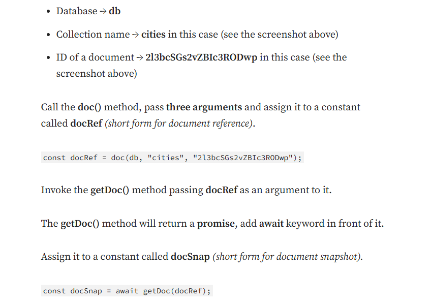:
TAKE REFERENCE OF THAT PATH USING doc(3 args:db,path,docid)
Call the doc() method, pass three arguments and assign it to a constant called docRef (short form for document reference).

const docRef = doc(db, "cities", "2l3bcSGs2vZBIc3RODwp");
then use getDoc(1 arg: docRef) method to get the data from that path
fore.g:const docSnap = await getDoc(docRef);
3. get data using : docSnap.data() method and id by docSnap.id

//----------------new data like commenting in the firebase----------
//1. get the reference of the path where you want to add the data
const docRef = doc(db, "posts", localPost.id);
2. use setDoc(2 args:docRef,object data) method to add the data
use async await or then and catch method to handle the promise
full  code :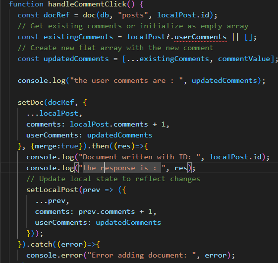

//---------------
<ul> cannot be a descendant of 
.
whenever you use markdown use div instead of p tag because of this error:<ul> cannot be a descendant of 
.
for e.g:

              <Markdown>{AiDescription}</Markdown>
            
✔

 <markdown> 
❌
//?. is used to check if the object is null or not
for e.g: const userMeta = getAdditionalUserInfo(userCredential);
        if (userMeta?.isNewUser) {
          set(ref(db, `users/ ${username}`), {
            name: username,
            email: userCredential.user.email,
            password: password,
          });
        }

//----------exampe 2:
approach with optional chaining (?.) is good practice for runtime safety, but to make it fully TypeScript compliant, you need to properly define the optional property in your interface.
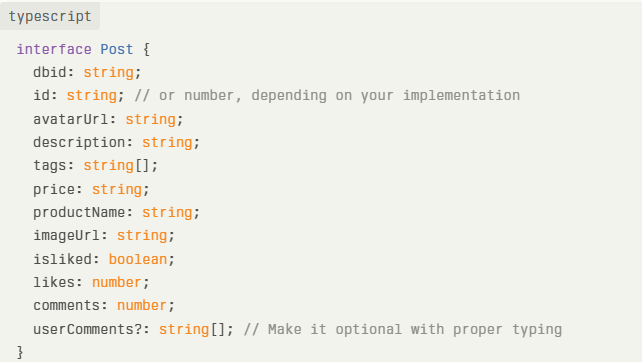

//-----------RANDDOM AVATAR GENERATOR FETCHING FROM :https://xsgames.co/randomusers/ : API 

  src={`https://xsgames.co/randomusers/avatar.php?g=${(Math.floor(Math.random()*10) >5)? "male" :"female"  }`}

FOR E.G:
 5)? "male" :"female"  }`}
            className="w-14 h-14 rounded-full border-2 border-purple-200"
            alt="User"
          />
: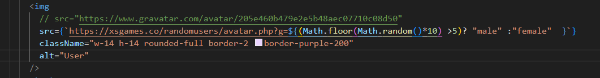

//-----------------------------
//--------------------CSSSSSSSSS------------------------
GOLDEN COLORS OF TAILWIND CSS:
 
              ${localPost.price}
            
    LIKE :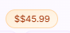

2. aria label is v imp so that the screen reader can read the content of the button
3. name ,id ,value is also imp for the input field

//4---------------csss some animation styling:
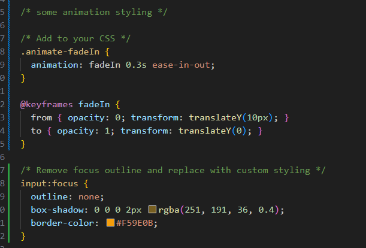